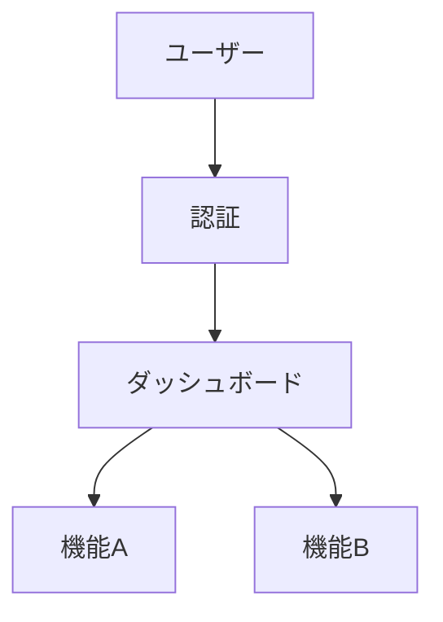

# 開発ルール・ガイドライン

## 概要
このドキュメントは、Claude Codeを使用した開発プロジェクトにおける標準的な開発フローとルールを定義します。

## プロジェクト構造

リポジトリは`docs/`ディレクトリ配下で2つのカテゴリのドキュメントを管理します：

```
docs/
├── persistent/              # 永続的ドキュメント
│   ├── product-requirements.md
│   ├── functional-design.md
│   ├── architecture.md
│   ├── repository-structure.md
│   ├── development-guidelines.md
│   └── glossary.md
├── steering/                # 作業単位ドキュメント
│   ├── 20251128-initial-setup/
│   │   ├── requirements.md
│   │   ├── design.md
│   │   └── tasklist.md
│   └── 20251201-feature-name/
│       ├── requirements.md
│       ├── design.md
│       └── tasklist.md
└── images/                  # 図表用の画像
```

### 永続的ドキュメント（docs/persistent/）
プロジェクトの基礎となる仕様を含む、めったに変更されないドキュメント：

- **product-requirements.md** - 製品ビジョン、ターゲットユーザー、機能、成功基準
- **functional-design.md** - アーキテクチャ、システム図、データモデル、コンポーネント、UI フロー
- **architecture.md** - 技術スタック、ツール、技術的制約、パフォーマンス要件
- **repository-structure.md** - フォルダ構成とファイル配置ルール
- **development-guidelines.md** - コーディング規約、命名規則、テスト慣行
- **glossary.md** - ドメイン用語とユビキタス言語の定義

### 作業単位ドキュメント（docs/steering/[YYYYMMDD]-[title]/）
特定の開発タスクのための一時的なステアリングファイル：

- **requirements.md** - 機能変更と受入基準
- **design.md** - 実装アプローチと影響を受けるコンポーネント
- **tasklist.md** - 具体的なタスクと完了条件

## 開発プロセス

### 初期セットアップ手順
1. `docs/persistent/`、`docs/steering/`、`docs/images/` ディレクトリを作成
2. 永続的ドキュメントを順次作成し、各ファイル作成後に承認を取得
   - `docs/persistent/product-requirements.md`
   - `docs/persistent/functional-design.md`
   - `docs/persistent/architecture.md`
   - `docs/persistent/repository-structure.md`
   - `docs/persistent/development-guidelines.md`
   - `docs/persistent/glossary.md`
3. 最初の実装用ステアリングディレクトリを作成（例：`docs/steering/20251128-initial-setup/`）
4. ステアリングドキュメントを作成し、各ファイル作成後に承認を取得
   - `docs/steering/[日付]-[タイトル]/requirements.md`
   - `docs/steering/[日付]-[タイトル]/design.md`
   - `docs/steering/[日付]-[タイトル]/tasklist.md`
5. 環境をセットアップ
6. タスクリストに従って開発を開始
7. 品質チェックを実施

### 機能追加・修正手順
1. 既存ドキュメントへの影響を分析
2. 日付付きステアリングディレクトリを作成（例：`docs/steering/20251128-user-auth/`）
3. 段階的承認を得ながら作業単位ドキュメントを生成
   - `docs/steering/[日付]-[タイトル]/requirements.md`
   - `docs/steering/[日付]-[タイトル]/design.md`
   - `docs/steering/[日付]-[タイトル]/tasklist.md`
4. 設計が根本的に変わる場合は `docs/persistent/` 内のドキュメントを更新
5. タスクリストに従って実装
6. 品質保証を実行

### ドキュメント作成の原則

**永続的ドキュメント**は、プロジェクトの「北極星」として安定したアンカーとして機能し、大きなアーキテクチャの変更時のみ更新されます。

**ステアリングドキュメント**は、特定の作業の意図を捉え、履歴記録として保持されますが、新しいタスクには引き継がれません。

## レビュー・承認プロセス

### 必須承認ポイント
以下のタイミングで必ずユーザーレビューと承認を取得：

#### 初期セットアップ時
1. ✅ `docs/persistent/product-requirements.md` 完成時
2. ✅ `docs/persistent/functional-design.md` 完成時
3. ✅ `docs/persistent/architecture.md` 完成時
4. ✅ `docs/persistent/repository-structure.md` 完成時
5. ✅ `docs/persistent/development-guidelines.md` 完成時
6. ✅ `docs/persistent/glossary.md` 完成時
7. ✅ `docs/steering/[日付]-[タイトル]/requirements.md` 完成時
8. ✅ `docs/steering/[日付]-[タイトル]/design.md` 完成時
9. ✅ `docs/steering/[日付]-[タイトル]/tasklist.md` 完成時

#### 機能追加・修正時
1. ✅ 新しいステアリングディレクトリの `requirements.md` 完成時
2. ✅ 新しいステアリングディレクトリの `design.md` 完成時
3. ✅ 新しいステアリングディレクトリの `tasklist.md` 完成時
4. ✅ 各主要機能の実装完了時
5. ✅ 品質チェック完了時

### レビュー時の確認事項
- 要件を満たしているか
- 設計通りに実装されているか
- コードの品質（可読性、保守性）
- セキュリティ上の問題はないか
- パフォーマンスは許容範囲か
- ドキュメント間の整合性が取れているか

## 実装の原則

### 段階的開発
設計書に基づき、以下の原則で段階的に開発を進めます：

1. **小さな単位で実装**: 1つの機能またはモジュール単位で実装
2. **動作確認**: 各実装後、必ず動作確認を実施
3. **コミット**: 動作確認後、適切な単位でコミット
4. **進捗報告**: 各段階の完了時にユーザーへ報告

### 実装順序
`tasklist.md` で定義した順序に従い実装を進めます：

1. **基盤層**: ディレクトリ構造、設定ファイル、共通モジュール
2. **データ層**: データモデル、データベース接続
3. **ビジネスロジック層**: コアとなる機能実装
4. **プレゼンテーション層**: UI、API実装
5. **統合・調整**: 各層の統合とエラーハンドリング

### コーディング規約
`docs/persistent/development-guidelines.md` に従います。主なポイント：

- **命名規則**: プロジェクトの言語・フレームワークの標準に従う
- **コメント**: 複雑なロジックには必ずコメントを追加
- **エラーハンドリング**: 適切な例外処理とエラーメッセージ
- **セキュリティ**: OWASP Top 10の脆弱性に注意
  - SQL Injection対策
  - XSS対策
  - CSRF対策
  - コマンドインジェクション対策
- **シンプルさの維持**: 過度な抽象化や将来の拡張を想定した実装を避ける

### テスト・検証
各実装段階で以下のテストを実施：

- **単体テスト**: 個別機能の動作確認
- **結合テスト**: モジュール間の連携確認
- **エンドツーエンドテスト**: システム全体の動作確認
- **セキュリティテスト**: 脆弱性の確認

## 図表とビジュアル要素

### 図表の作成と管理
- **Mermaid記法を優先**: マークダウン内に埋め込み可能
- **ASCII アート**: シンプルな図に使用可能
- **画像ファイル**: 必要な場合は `docs/images/` ディレクトリに格納

### 図表の更新
- 対応する設計が変更された際は必ず図表も更新
- コードとドキュメントの乖離を防止

### Mermaid記法の例


## Claude Code使用時の注意事項

### タスク管理
- 複雑なタスクは TodoWrite ツールで計画を立てる
- 各タスクの進捗を随時報告
- タスク完了時は速やかにステータス更新
- `tasklist.md` の内容と連携させる

### 質問・確認
- 不明点や曖昧な点は AskUserQuestion ツールで確認
- 重要な設計判断は必ずユーザーに確認
- 複数の実装方法がある場合は選択肢を提示
- ドキュメントに記載されていない内容は推測せず確認

### ファイル操作
- 既存ファイルの確認: 編集前に必ず Read ツールで内容を確認
- 段階的な変更: 一度に大量の変更を避け、小さな単位で実施
- バックアップ: 重要な変更前はGitコミットを推奨
- ドキュメント構造を遵守: `docs/persistent/` と `docs/steering/` の役割を守る

### ドキュメント整合性の維持
- 永続的ドキュメントを更新する場合は、影響範囲を確認
- ステアリングドキュメントは履歴として保持し、次のタスクに引き継がない
- 図表とコードの乖離を防ぐため、変更時は両方を更新

## トラブルシューティング

### 問題発生時の対応
1. エラーメッセージと状況を詳細に記録
2. 原因を特定するため、関連ファイルを調査
3. 修正方法を検討し、複数案がある場合はユーザーに確認
4. 修正実施後、必ず動作確認
5. 再発防止策を検討
6. 必要に応じてドキュメントを更新

### エスカレーション
以下の場合はユーザーに報告し、判断を仰ぐ：
- 要件や設計の変更が必要な場合
- 技術的に実現困難な要件がある場合
- セキュリティ上のリスクがある場合
- 大幅な工数増加が見込まれる場合
- 永続的ドキュメントの大幅な変更が必要な場合

## バージョン管理

### Gitの使用
- **コミットタイミング**: 各機能の実装完了時、ドキュメント更新時
- **コミットメッセージ**: 変更内容を明確に記述（例：`feat: ユーザー認証機能を追加`）
- **ブランチ戦略**: プロジェクトに応じて適切な戦略を採用
- **プルリクエスト**: 大きな変更は PR 経由でレビュー
- **履歴の保持**: ステアリングディレクトリは削除せず履歴として保持

## 重要なリマインダー

### 各ドキュメント完成後に必ず承認を取得
- ドキュメントを作成したら、次に進む前に必ずユーザーの承認を待つ
- 承認なしに次のステップに進まない
- 修正が必要な場合は、修正後に再度承認を取得

### ステアリングディレクトリの命名
- 明確な命名: 日付 + 説明的なタイトル（例：`docs/steering/20251128-user-authentication/`）
- 日付形式: `YYYYMMDD` を使用
- タイトル: ケバブケース（小文字、ハイフン区切り）を推奨

### ドキュメントの区別
- **永続的ドキュメント**: プロジェクトの基盤となる仕様、めったに変更しない
- **ステアリングドキュメント**: 特定タスクの一時的な作業指示、タスク完了後も履歴として保持

### 図表の保守性
- Mermaid記法を使用して、メンテナンスのオーバーヘッドを最小化
- 複雑な図が必要な場合のみ画像ファイルを使用
- 設計変更時は対応する図表も必ず更新

### セキュリティとコーディング規約
- 一貫したセキュリティ基準とコーディング規約を全体に適用
- `docs/persistent/development-guidelines.md` を参照
- レビュー時に必ずセキュリティチェックを実施

## まとめ

このガイドラインに従うことで：
- ✅ 計画的で段階的な開発が可能
- ✅ ドキュメントとコードの整合性を維持
- ✅ 品質の高いコードが維持できる
- ✅ ユーザーとの認識齟齬を防止できる
- ✅ 問題の早期発見と対応が可能
- ✅ プロジェクトの履歴を明確に追跡可能

---

**最終更新**: 2025-11-28
**バージョン**: 2.1