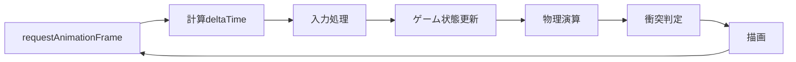

# アーキテクチャ設計書（Architecture Document）

## 概要
本ドキュメントでは、ヴァンサバライクブラウザゲームの技術スタック、ツール選定、技術的制約、パフォーマンス要件を定義します。

## 技術スタック

### フロントエンド技術

#### コア技術
- **言語**: TypeScript 5.x
  - 理由: 型安全性、開発効率、保守性の向上
  - ゲームロジックの複雑性に対応するため型システムが必須

- **実行環境**: ブラウザ（モダンブラウザ対応）
  - Chrome 100+
  - Firefox 100+
  - Safari 15+
  - Edge 100+

#### レンダリング
- **Canvas API**: HTML5 Canvas 2D Context
  - 理由:
    - ブラウザネイティブで追加ライブラリ不要
    - 2Dゲームに十分な性能
    - 学習コストが低い
    - 軽量で高速な描画が可能
  - 代替案:
    - WebGL: より高度な3D表現が必要な場合
    - Phaser/PixiJS: より多機能なゲームエンジンが必要な場合

#### ビルドツール
- **Vite 5.x**
  - 理由:
    - 高速な開発サーバー
    - TypeScriptネイティブサポート
    - 最適化されたプロダクションビルド
    - HMR（Hot Module Replacement）対応

#### パッケージ管理
- **npm** または **yarn**
  - プロジェクトの依存関係管理

### 開発ツール

#### コード品質
- **ESLint**: コード品質チェック
- **Prettier**: コードフォーマッター
- **TypeScript Compiler**: 型チェック

#### テスト（将来的に導入）
- **Vitest**: ユニットテスト
- **Playwright**: E2Eテスト

#### バージョン管理
- **Git**: ソースコード管理
- **GitHub**: リポジトリホスティング

## アーキテクチャパターン

### Entity Component System (ECS) の簡易版

ゲームオブジェクトを効率的に管理するため、ECSパターンの簡易版を採用します。

```typescript
// Entity: ゲームオブジェクトの識別子と状態
interface Entity {
  id: string;
  type: EntityType;
  active: boolean;
}

// Component: 機能ごとのデータ
interface Component {
  position?: Vector2;
  velocity?: Vector2;
  health?: HealthComponent;
  combat?: CombatComponent;
  ai?: AIComponent;
}

// System: ロジック処理
class System {
  update(entities: Entity[], deltaTime: number): void;
}
```

### シーン管理パターン

状態遷移を明確にするため、シーンパターンを採用します。

```typescript
interface Scene {
  init(): void;
  update(deltaTime: number): void;
  render(): void;
  cleanup(): void;
}

class SceneManager {
  private currentScene: Scene;
  private scenes: Map<string, Scene>;

  changeScene(sceneName: string): void {
    this.currentScene?.cleanup();
    this.currentScene = this.scenes.get(sceneName);
    this.currentScene?.init();
  }
}
```

### オブジェクトプール

頻繁に生成・破棄されるオブジェクト（敵、弾丸、エフェクト等）のパフォーマンス最適化のため、オブジェクトプールパターンを採用します。

```typescript
class ObjectPool<T> {
  private available: T[] = [];
  private inUse: Set<T> = new Set();

  acquire(): T {
    if (this.available.length === 0) {
      return this.createNew();
    }
    const obj = this.available.pop()!;
    this.inUse.add(obj);
    return obj;
  }

  release(obj: T): void {
    this.inUse.delete(obj);
    this.available.push(obj);
  }
}
```

## ディレクトリ構造（技術視点）

```
project-root/
├── src/
│   ├── core/              # コアエンジン機能
│   │   ├── Game.ts        # メインゲームクラス
│   │   ├── Scene.ts       # シーン基底クラス
│   │   ├── Renderer.ts    # レンダリングエンジン
│   │   ├── Input.ts       # 入力管理
│   │   └── Time.ts        # 時間管理
│   ├── entities/          # ゲームエンティティ
│   │   ├── Player.ts
│   │   ├── Enemy.ts
│   │   ├── Weapon.ts
│   │   └── ExperienceOrb.ts
│   ├── systems/           # ゲームシステム
│   │   ├── CollisionSystem.ts
│   │   ├── SpawnSystem.ts
│   │   ├── LevelSystem.ts
│   │   └── CombatSystem.ts
│   ├── scenes/            # シーン実装
│   │   ├── TitleScene.ts
│   │   ├── GameScene.ts
│   │   └── GameOverScene.ts
│   ├── ui/                # UI コンポーネント
│   │   ├── HUD.ts
│   │   ├── LevelUpPanel.ts
│   │   └── GameOverScreen.ts
│   ├── utils/             # ユーティリティ
│   │   ├── Vector2.ts
│   │   ├── MathUtils.ts
│   │   └── Random.ts
│   ├── config/            # 設定ファイル
│   │   ├── GameConfig.ts
│   │   ├── EnemyConfig.ts
│   │   └── WeaponConfig.ts
│   ├── types/             # 型定義
│   │   └── index.ts
│   ├── assets/            # アセット（インポート用）
│   │   ├── sprites/
│   │   ├── sounds/
│   │   └── fonts/
│   └── main.ts            # エントリーポイント
├── public/                # 静的ファイル
│   ├── index.html
│   └── assets/            # 実際のアセットファイル
├── docs/                  # ドキュメント
├── tests/                 # テストコード（将来）
├── package.json
├── tsconfig.json
├── vite.config.ts
└── README.md
```

## データフロー

### ゲームループ



### 状態管理

```typescript
// グローバル状態は最小限に抑える
class GameState {
  private static instance: GameState;

  player: Player;
  enemies: Enemy[];
  weapons: Weapon[];
  experienceOrbs: ExperienceOrb[];

  gameTime: number;
  isPaused: boolean;

  static getInstance(): GameState {
    if (!GameState.instance) {
      GameState.instance = new GameState();
    }
    return GameState.instance;
  }
}
```

## パフォーマンス要件と最適化

### 目標パフォーマンス

#### フレームレート
- **目標**: 60 FPS（16.67ms/フレーム）
- **最低**: 30 FPS（33.33ms/フレーム）
- **測定方法**: ブラウザのパフォーマンスAPI使用

#### メモリ使用量
- **初期ロード**: 50MB以下
- **ゲームプレイ中**: 100MB以下
- **メモリリーク**: なし（長時間プレイテスト）

#### ロード時間
- **初回ロード**: 3秒以内（通常回線）
- **シーン遷移**: 0.5秒以内

### 最適化戦略

#### 1. レンダリング最適化

**オフスクリーンキャンバス**
```typescript
// 静的な背景は事前レンダリング
class BackgroundRenderer {
  private offscreenCanvas: HTMLCanvasElement;

  preRender(): void {
    // 背景を一度だけ描画
    // 毎フレーム再利用
  }
}
```

**カリング**
```typescript
// 画面外のオブジェクトは描画しない
function isInView(position: Vector2, camera: Camera): boolean {
  return (
    position.x >= camera.x - buffer &&
    position.x <= camera.x + camera.width + buffer &&
    position.y >= camera.y - buffer &&
    position.y <= camera.y + camera.height + buffer
  );
}
```

#### 2. 衝突判定最適化

**空間分割（Spatial Hashing）**
```typescript
class SpatialHash {
  private cellSize: number;
  private grid: Map<string, Entity[]>;

  getNearbyEntities(position: Vector2, radius: number): Entity[] {
    // セル単位で近接エンティティを高速取得
  }
}
```

#### 3. メモリ管理

**オブジェクトプール**
- 敵: 最大200インスタンス
- 弾丸: 最大500インスタンス
- エフェクト: 最大100インスタンス
- 経験値オーブ: 最大300インスタンス

**ガベージコレクション対策**
```typescript
// 配列の再利用
class ReusableArray<T> {
  private items: T[] = [];
  private count: number = 0;

  add(item: T): void {
    this.items[this.count++] = item;
  }

  clear(): void {
    this.count = 0; // 配列は再利用
  }
}
```

#### 4. アセット最適化

**画像最適化**
- スプライトシート使用（複数画像を1枚に統合）
- 適切なサイズとフォーマット（PNG/WebP）
- 最大ファイルサイズ: 個別画像 100KB以下

**音声最適化**
- フォーマット: WebM/MP3
- サウンドエフェクト: モノラル、短時間
- 最大ファイルサイズ: 50KB以下

## セキュリティ考慮事項

### Phase 1（クライアントサイドのみ）

#### XSS対策
- ユーザー入力は現時点でなし
- 将来的に名前入力等がある場合はサニタイズ必須

#### データ整合性
- ローカルストレージ使用時は改ざん検証不要（オフライン）
- ランキング実装時は検証必須

### Phase 2以降（オンライン機能）

#### サーバーサイド検証
- スコア送信時のバリデーション
- 不正な値の検出と拒否
- レート制限

#### 通信セキュリティ
- HTTPS必須
- API認証トークン

## 技術的制約

### ブラウザ制約
- Canvas 2D APIの機能範囲内
- ブラウザのセキュリティポリシー準拠
- ローカルストレージ容量制限（5-10MB）

### パフォーマンス制約
- JavaScript実行速度の限界
- シングルスレッド実行（Web Workerは将来検討）
- メモリ制約（ブラウザタブあたり）

### 互換性制約
- ES2020以降の機能使用
- モダンブラウザのみ対応（IE非対応）
- ポリフィル最小限

## 開発環境セットアップ

### 必須ソフトウェア
- Node.js 18.x以上
- npm 9.x以上 または yarn 3.x以上
- Git 2.x以上
- モダンブラウザ（開発者ツール付き）

### 推奨開発環境
- **エディタ**: VSCode
- **拡張機能**:
  - ESLint
  - Prettier
  - TypeScript and JavaScript Language Features

### セットアップ手順
```bash
# リポジトリクローン
git clone [repository-url]
cd [project-name]

# 依存パッケージインストール
npm install

# 開発サーバー起動
npm run dev

# ビルド
npm run build

# プレビュー
npm run preview
```

## デプロイメント

### Phase 1（静的ホスティング）
- **プラットフォーム**: GitHub Pages / Netlify / Vercel
- **方法**:
  1. `npm run build` でビルド
  2. `dist/` フォルダをデプロイ
- **URL**: カスタムドメインまたはサブドメイン

### Phase 2以降（バックエンド必要時）
- **フロントエンド**: 上記と同様
- **バックエンド**: Node.js + Express / AWS Lambda
- **データベース**: PostgreSQL / MongoDB
- **ホスティング**: AWS / GCP / Azure

## モニタリングとログ

### パフォーマンス監視
```typescript
class PerformanceMonitor {
  private frameTime: number[] = [];

  recordFrame(deltaTime: number): void {
    this.frameTime.push(deltaTime);
    if (this.frameTime.length > 60) {
      this.frameTime.shift();
    }
  }

  getAverageFPS(): number {
    const avg = this.frameTime.reduce((a, b) => a + b) / this.frameTime.length;
    return 1000 / avg;
  }
}
```

### エラーログ
```typescript
class Logger {
  static error(message: string, error?: Error): void {
    console.error(`[ERROR] ${message}`, error);
    // 将来的に外部サービスへ送信
  }

  static warn(message: string): void {
    console.warn(`[WARN] ${message}`);
  }

  static info(message: string): void {
    console.info(`[INFO] ${message}`);
  }
}
```

## 将来の技術拡張

### Phase 2
- Web Audio API（高品質サウンド）
- Web Workers（物理演算の並列化）
- IndexedDB（大容量ローカルストレージ）

### Phase 3
- WebGL（高度なエフェクト）
- WebSocket（リアルタイム通信）
- PWA（オフライン対応）
- WebAssembly（高速計算）

---

**作成日**: 2025-11-28
**バージョン**: 1.0
**ステータス**: ドラフト（レビュー待ち）
