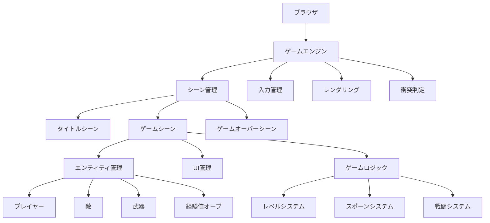
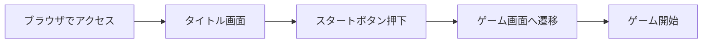
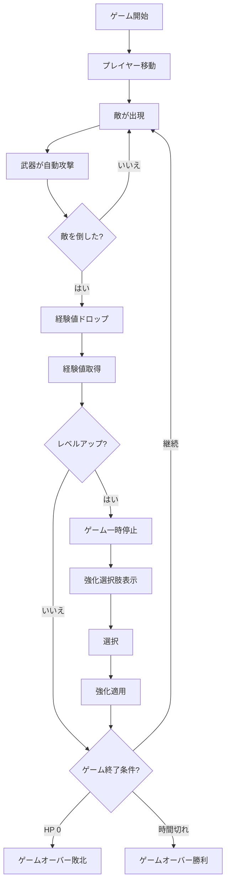
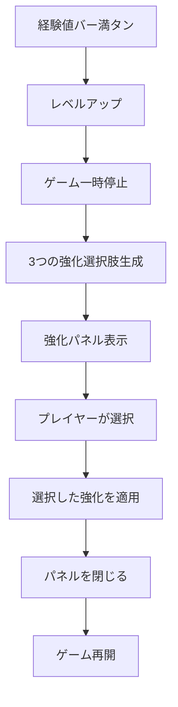
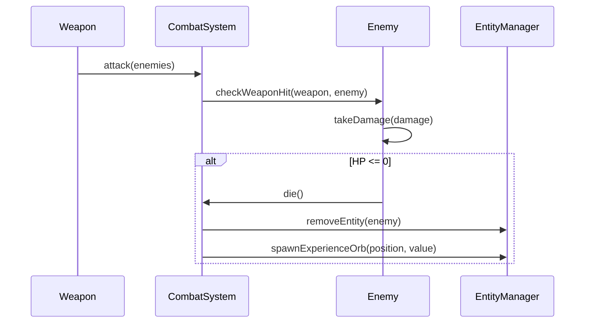
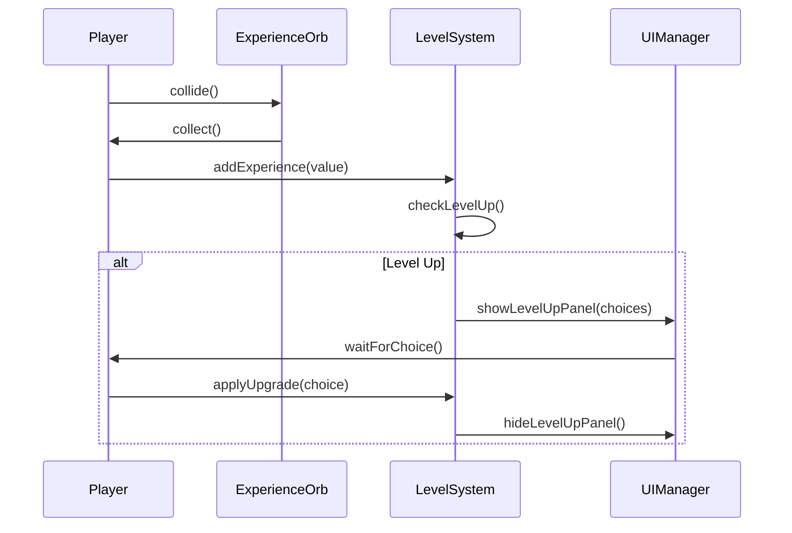

# 機能設計書（Functional Design Document）

## 概要
本ドキュメントでは、ヴァンサバライクブラウザゲームのシステムアーキテクチャ、データモデル、コンポーネント設計、UIフローを定義します。

## システムアーキテクチャ

### 全体構成図



### レイヤー構造

```
┌─────────────────────────────────┐
│  Presentation Layer (UI)        │  画面表示、ユーザー入力
├─────────────────────────────────┤
│  Game Logic Layer               │  ゲームルール、状態管理
├─────────────────────────────────┤
│  Entity Layer                   │  ゲームオブジェクト
├─────────────────────────────────┤
│  Core Engine Layer              │  レンダリング、衝突判定
└─────────────────────────────────┘
```

## データモデル

### プレイヤーデータ

```typescript
interface Player {
  position: Vector2;        // 座標
  velocity: Vector2;        // 速度
  hp: number;               // 現在HP
  maxHp: number;            // 最大HP
  level: number;            // レベル
  experience: number;       // 現在経験値
  experienceToNext: number; // 次のレベルまでの必要経験値
  moveSpeed: number;        // 移動速度
  collisionRadius: number;  // 衝突判定半径
}
```

### 敵データ

```typescript
interface Enemy {
  id: string;               // 一意識別子
  type: string;             // 敵タイプ
  position: Vector2;        // 座標
  velocity: Vector2;        // 速度
  hp: number;               // 現在HP
  maxHp: number;            // 最大HP
  moveSpeed: number;        // 移動速度
  damage: number;           // 接触ダメージ
  experienceDrop: number;   // ドロップ経験値
  collisionRadius: number;  // 衝突判定半径
}
```

### 武器データ

```typescript
interface Weapon {
  id: string;               // 武器ID
  name: string;             // 武器名
  level: number;            // 武器レベル
  damage: number;           // ダメージ
  attackSpeed: number;      // 攻撃間隔（秒）
  range: number;            // 攻撃範囲
  projectileSpeed: number;  // 弾速（該当する場合）
  piercing: number;         // 貫通数
  lastAttackTime: number;   // 最後の攻撃時刻
}
```

### 経験値オーブデータ

```typescript
interface ExperienceOrb {
  id: string;               // 一意識別子
  position: Vector2;        // 座標
  value: number;            // 経験値量
  magnetized: boolean;      // プレイヤーに引き寄せられているか
}
```

### ゲーム状態データ

```typescript
interface GameState {
  isRunning: boolean;       // ゲーム実行中か
  isPaused: boolean;        // 一時停止中か
  elapsedTime: number;      // 経過時間（秒）
  maxTime: number;          // 制限時間（秒）
  killCount: number;        // 撃破数
  currentWave: number;      // 現在のウェーブ
}
```

## コンポーネント設計

### コアコンポーネント

#### 1. GameEngine（ゲームエンジン）
- **責務**: ゲームループの管理、各システムの初期化と更新
- **主要メソッド**:
  - `init()`: 初期化
  - `update(deltaTime)`: 毎フレーム更新
  - `render()`: 描画
  - `handleInput()`: 入力処理

#### 2. SceneManager（シーン管理）
- **責務**: シーンの切り替えとライフサイクル管理
- **主要メソッド**:
  - `changeScene(sceneName)`: シーン切り替え
  - `getCurrentScene()`: 現在のシーン取得
  - `updateScene(deltaTime)`: シーン更新
  - `renderScene()`: シーン描画

#### 3. InputManager（入力管理）
- **責務**: キーボード入力の検知と状態管理
- **主要メソッド**:
  - `isKeyPressed(key)`: キー押下状態確認
  - `getMovementDirection()`: 移動方向取得
  - `update()`: 入力状態更新

#### 4. Renderer（レンダリング）
- **責務**: Canvas描画の管理
- **主要メソッド**:
  - `clear()`: 画面クリア
  - `drawSprite(sprite, position)`: スプライト描画
  - `drawRect(x, y, width, height, color)`: 矩形描画
  - `drawText(text, x, y, options)`: テキスト描画
  - `drawHealthBar(current, max, position)`: HPバー描画

#### 5. CollisionManager（衝突判定）
- **責務**: エンティティ間の衝突検出
- **主要メソッド**:
  - `checkCircleCollision(entity1, entity2)`: 円形衝突判定
  - `getEntitiesInRange(position, radius)`: 範囲内のエンティティ取得

### ゲームシステムコンポーネント

#### 6. EntityManager（エンティティ管理）
- **責務**: 全エンティティの生成、更新、削除
- **主要メソッド**:
  - `addEntity(entity)`: エンティティ追加
  - `removeEntity(id)`: エンティティ削除
  - `getEntitiesByType(type)`: タイプ別取得
  - `updateAll(deltaTime)`: 全エンティティ更新

#### 7. SpawnSystem（スポーンシステム）
- **責務**: 敵の生成管理
- **主要メソッド**:
  - `update(deltaTime)`: スポーン処理
  - `spawnEnemy(type, position)`: 敵生成
  - `getSpawnRate()`: 現在のスポーン速度計算

#### 8. LevelSystem（レベルシステム）
- **責務**: 経験値とレベルアップ管理
- **主要メソッド**:
  - `addExperience(amount)`: 経験値追加
  - `levelUp()`: レベルアップ処理
  - `getExperienceToNext()`: 次のレベルまでの必要経験値計算
  - `showUpgradeChoices()`: 強化選択肢表示

#### 9. CombatSystem（戦闘システム）
- **責務**: ダメージ処理と戦闘ロジック
- **主要メソッド**:
  - `dealDamage(attacker, target, damage)`: ダメージ処理
  - `checkWeaponHit(weapon, enemy)`: 武器の命中判定
  - `processEnemyDeath(enemy)`: 敵の死亡処理

#### 10. UIManager（UI管理）
- **責務**: ゲーム内UI表示
- **主要メソッド**:
  - `updateHPBar(current, max)`: HPバー更新
  - `updateExpBar(current, required)`: 経験値バー更新
  - `updateGameInfo(time, killCount)`: ゲーム情報更新
  - `showLevelUpPanel(choices)`: レベルアップパネル表示

### エンティティコンポーネント

#### 11. Player（プレイヤー）
- **責務**: プレイヤーの状態と行動
- **主要メソッド**:
  - `update(deltaTime)`: 位置更新
  - `move(direction)`: 移動処理
  - `takeDamage(amount)`: ダメージ受ける
  - `gainExperience(amount)`: 経験値獲得
  - `die()`: 死亡処理

#### 12. Enemy（敵）
- **責務**: 敵の状態と行動
- **主要メソッド**:
  - `update(deltaTime)`: AI更新と移動
  - `moveTowardsPlayer(player)`: プレイヤーへ移動
  - `takeDamage(amount)`: ダメージ受ける
  - `die()`: 死亡処理とドロップ

#### 13. Weapon（武器）
- **責務**: 武器の攻撃処理
- **主要メソッド**:
  - `update(deltaTime)`: 攻撃タイミング管理
  - `attack(enemies)`: 攻撃実行
  - `upgrade(stat)`: 性能強化
  - `findNearestEnemy(enemies)`: 最寄りの敵検索

#### 14. ExperienceOrb（経験値オーブ）
- **責務**: 経験値アイテムの挙動
- **主要メソッド**:
  - `update(deltaTime)`: 移動更新
  - `magnetToPlayer(player)`: プレイヤーへ引き寄せ
  - `collect()`: 収集処理

## シーン設計

### 1. TitleScene（タイトルシーン）
- **表示内容**:
  - ゲームタイトル
  - スタートボタン
  - 簡易説明（操作方法）
- **遷移**:
  - スタートボタン → GameScene

### 2. GameScene（ゲームシーン）
- **表示内容**:
  - ゲームフィールド
  - プレイヤーキャラクター
  - 敵キャラクター
  - 武器エフェクト
  - UI（HP、経験値、時間、撃破数）
- **遷移**:
  - プレイヤー死亡 → GameOverScene
  - 制限時間終了 → GameOverScene（勝利）

### 3. GameOverScene（ゲームオーバーシーン）
- **表示内容**:
  - 結果表示（勝利/敗北）
  - 生存時間
  - 撃破数
  - リトライボタン
  - タイトルに戻るボタン
- **遷移**:
  - リトライ → GameScene
  - タイトルへ → TitleScene

## UIフロー

### ゲーム開始フロー



### ゲームプレイフロー



### レベルアップフロー



## 画面レイアウト

### ゲーム画面レイアウト

```
┌─────────────────────────────────────────────┐
│  HP: ████████░░  Lv.5  [████████░░] 80/100  │ ← ヘッダーUI
├─────────────────────────────────────────────┤
│                                             │
│         👤 Player                           │
│                                             │
│    💀        💀                             │
│         💀        💀                        │ ← ゲームフィールド
│                      💀                     │
│  💀                                         │
│                                             │
├─────────────────────────────────────────────┤
│  Time: 05:32  |  Kills: 127                 │ ← フッターUI
└─────────────────────────────────────────────┘
```

### レベルアップパネル

```
┌─────────────────────────────────────────────┐
│            LEVEL UP!                        │
│                                             │
│  ┌───────────────┐  ┌───────────────┐      │
│  │  武器ダメージ  │  │  攻撃速度     │      │
│  │  +20%         │  │  +15%         │      │
│  │               │  │               │      │
│  │  [選択]       │  │  [選択]       │      │
│  └───────────────┘  └───────────────┘      │
│                                             │
│  ┌───────────────┐                          │
│  │  攻撃範囲     │                          │
│  │  +25%         │                          │
│  │               │                          │
│  │  [選択]       │                          │
│  └───────────────┘                          │
└─────────────────────────────────────────────┘
```

## ゲームバランス設計

### プレイヤー初期値
- HP: 100
- 移動速度: 200 (px/s)
- 衝突半径: 20px

### 敵（基本タイプ）初期値
- HP: 10
- 移動速度: 80 (px/s)
- ダメージ: 5
- 経験値ドロップ: 1
- 衝突半径: 15px

### 武器（基本タイプ）初期値
- ダメージ: 10
- 攻撃速度: 1.0秒（1秒に1回）
- 攻撃範囲: 150px
- 貫通数: 1

### レベルアップ計算式
```
必要経験値 = 10 + (level * 5)
```

### スポーンレート
```
初期: 2秒に1体
1分経過: 1秒に1体
5分経過: 0.5秒に1体
10分経過: 0.3秒に1体
```

### 強化選択肢
各レベルアップ時、以下からランダムに3つ選択：
1. 武器ダメージ +20%
2. 攻撃速度 +15%
3. 攻撃範囲 +25%
4. 武器貫通 +1
5. 移動速度 +10%
6. 最大HP +20
7. HP回復 50%

## データフロー

### ダメージ処理フロー



### 経験値取得フロー



## 拡張性設計

### 新キャラクター追加
```typescript
interface CharacterConfig {
  id: string;
  name: string;
  baseHp: number;
  moveSpeed: number;
  startingWeapon: string;
  specialAbility?: string;
}
```

### 新武器追加
```typescript
interface WeaponConfig {
  id: string;
  name: string;
  type: 'projectile' | 'melee' | 'aura';
  baseDamage: number;
  baseAttackSpeed: number;
  baseRange: number;
  upgradeTable: UpgradeConfig[];
}
```

### 新ステージ追加
```typescript
interface StageConfig {
  id: string;
  name: string;
  duration: number;
  enemyTypes: string[];
  spawnRateMultiplier: number;
  backgroundImage: string;
}
```

## Phase 2以降の差別化要素設計

### 🌍 環境インタラクション設計

#### 地形タイルデータ
```typescript
enum TerrainType {
  Normal = 'normal',
  Water = 'water',
  Lava = 'lava',
  Grass = 'grass',
  Ice = 'ice',
  Burnt = 'burnt',  // 焼けた草地
}

interface TerrainTile {
  type: TerrainType;
  position: Vector2;
  effects: TerrainEffect;
}

interface TerrainEffect {
  moveSpeedMultiplier: number;  // 移動速度倍率
  damagePerSecond?: number;      // 継続ダメージ
  elementalDamageBonus?: {       // 属性ダメージボーナス
    [key in ElementType]?: number;
  };
  healingRate?: number;          // 回復速度
  slippery?: boolean;            // 滑るか
}
```

#### 破壊可能オブジェクトデータ
```typescript
interface DestructibleObject {
  id: string;
  type: 'rock' | 'tree' | 'building' | 'barrel';
  position: Vector2;
  hp: number;
  maxHp: number;
  destroyDamage: number;         // 破壊時の範囲ダメージ
  destroyRadius: number;         // 破壊時の範囲
  dropItems: ItemDrop[];         // ドロップアイテム
  collisionRadius: number;
}

interface ItemDrop {
  type: 'crystal' | 'exp' | 'health';
  amount: number;
  dropRate: number;              // ドロップ確率（0-1）
}
```

#### インタラクティブオブジェクトデータ
```typescript
interface InteractiveObject {
  id: string;
  type: 'fountain' | 'trap' | 'teleport' | 'barricade';
  position: Vector2;
  active: boolean;
  properties: {
    healRate?: number;           // 回復の泉用
    damage?: number;             // トラップ用
    destination?: Vector2;       // テレポート用
  };
}
```

### 🔮 属性システム設計

#### 属性タイプ
```typescript
enum ElementType {
  Fire = 'fire',
  Water = 'water',
  Thunder = 'thunder',
  Nature = 'nature',
  Dark = 'dark',
}

interface ElementalEffect {
  element: ElementType;
  power: number;                 // 効果の強さ（0-1）
  duration?: number;             // 効果時間（秒）
}
```

#### 属性付き武器データ
```typescript
interface ElementalWeapon extends Weapon {
  elements: ElementalEffect[];   // 付与された属性（最大3つ）
  fusionEffect?: FusionEffect;   // フュージョン効果
  trinityEffect?: TrinityEffect; // トリニティ効果
}

interface FusionEffect {
  name: string;
  element1: ElementType;
  element2: ElementType;
  damageMultiplier: number;
  specialEffect: SpecialEffect;
}

interface TrinityEffect {
  name: string;
  elements: [ElementType, ElementType, ElementType];
  damageMultiplier: number;
  specialEffect: SpecialEffect;
  duration: number;
}

type SpecialEffect =
  | { type: 'dot'; damagePerSecond: number }              // 継続ダメージ
  | { type: 'slow'; slowAmount: number }                  // 減速
  | { type: 'chain'; maxTargets: number }                 // チェイン
  | { type: 'aoe'; radiusMultiplier: number }            // 範囲拡大
  | { type: 'freeze'; duration: number }                  // 凍結
  | { type: 'stun'; duration: number }                    // スタン
  | { type: 'drain'; drainPercent: number }              // HP吸収
  | { type: 'crit'; critChanceBonus: number }            // クリティカル
  | { type: 'explosion'; explosionRadius: number };      // 爆発
```

#### フュージョンテーブル
```typescript
const FUSION_TABLE: Record<string, FusionEffect> = {
  'fire+water': {
    name: '蒸気',
    element1: ElementType.Fire,
    element2: ElementType.Water,
    damageMultiplier: 1.3,
    specialEffect: { type: 'dot', damagePerSecond: 15 },
  },
  'fire+thunder': {
    name: 'プラズマ',
    element1: ElementType.Fire,
    element2: ElementType.Thunder,
    damageMultiplier: 2.0,
    specialEffect: { type: 'explosion', explosionRadius: 50 },
  },
  'water+thunder': {
    name: '嵐',
    element1: ElementType.Water,
    element2: ElementType.Thunder,
    damageMultiplier: 1.5,
    specialEffect: { type: 'chain', maxTargets: 5 },
  },
  // ... 他のフュージョン
};

const TRINITY_TABLE: Record<string, TrinityEffect> = {
  'fire+water+thunder': {
    name: '天災',
    elements: [ElementType.Fire, ElementType.Water, ElementType.Thunder],
    damageMultiplier: 3.0,
    specialEffect: { type: 'aoe', radiusMultiplier: 3.0 },
    duration: 5.0,
  },
  // ... 他のトリニティ
};
```

### システムコンポーネント追加（Phase 2以降）

#### 15. EnvironmentSystem（環境システム）
- **責務**: 地形効果と環境オブジェクトの管理
- **主要メソッド**:
  - `getTerrainAt(position)`: 指定位置の地形取得
  - `applyTerrainEffects(entity)`: エンティティに地形効果適用
  - `changeTerrain(position, newType)`: 地形変更
  - `updateDestructibles()`: 破壊可能オブジェクト更新

#### 16. ElementalSystem（属性システム）
- **責務**: 属性効果とフュージョンの計算
- **主要メソッド**:
  - `applyElementalDamage(target, element, damage)`: 属性ダメージ適用
  - `calculateFusion(elements)`: フュージョン効果計算
  - `calculateTrinity(elements)`: トリニティ効果計算
  - `updateElementalEffects(deltaTime)`: 属性効果の更新（DoT等）

#### 17. InteractionSystem（相互作用システム）
- **責務**: 環境と属性の相互作用処理
- **主要メソッド**:
  - `handleTerrainInteraction(element, terrain)`: 地形と属性の相互作用
    - 例: 火属性 + 草地 → 焼けた地面
    - 例: 水属性 + 溶岩 → 通常地面
  - `triggerChainReaction(position, element)`: 連鎖反応発動
  - `updateInteractiveObjects()`: インタラクティブオブジェクト更新

### データフロー（Phase 2以降）

#### 環境インタラクションフロー
```
プレイヤー移動
  ↓
EnvironmentSystem.getTerrainAt()
  ↓
地形効果を取得
  ↓
プレイヤーに効果適用
  ├→ 移動速度変更
  ├→ 継続ダメージ
  └→ 回復効果
```

#### 属性攻撃フロー
```
武器が攻撃
  ↓
ElementalSystem.applyElementalDamage()
  ↓
属性効果を適用
  ├→ 基本ダメージ
  ├→ 属性効果（DoT, Slow等）
  └→ フュージョン効果判定
        ↓
      2属性以上？
        ├→ Yes: FUSION_TABLE参照
        │       ↓
        │     特殊効果発動
        └→ No: 基本効果のみ
```

#### 環境×属性連鎖フロー
```
火属性武器で攻撃
  ↓
InteractionSystem.handleTerrainInteraction()
  ↓
地形が草地？
  ├→ Yes: 草地を焼く
  │       ↓
  │     EnvironmentSystem.changeTerrain()
  │       ↓
  │     焼けた地面に変化
  │       ↓
  │     周囲の敵にDoT
  └→ No: 通常攻撃
```

### UI拡張（Phase 2以降）

#### 属性表示UI
```typescript
interface ElementalHUD {
  displayWeaponElements(): void;      // 武器の属性表示
  displayFusionIndicator(): void;     // フュージョン発動表示
  displayTrinityCharge(): void;       // トリニティゲージ表示
}
```

#### 環境情報UI
```typescript
interface EnvironmentHUD {
  displayTerrainInfo(): void;         // 現在地の地形情報
  displayNearbyObjects(): void;       // 近くのオブジェクト表示
  displayEnvironmentTip(): void;      // 環境活用のヒント
}
```

---

**作成日**: 2025-11-28
**最終更新**: 2025-11-28
**バージョン**: 2.0
**ステータス**: 承認済み
**変更内容**: Phase 2以降の差別化要素（環境インタラクション＋属性システム）追加
